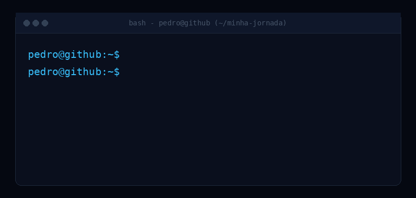

 

  

  

---

## `~/sobre-mim`

 

<table>
<tr>
<td width="700" align="center">

 

Sou **Pedro**, estudante de programação e atualmente estou
direcionando meus estudos para **DevOps**.

  

Estou no início dessa jornada e construindo minha base em
**Linux, Bash e Git**, enquanto aprendo mais sobre
infraestrutura, automação e o funcionamento dos sistemas.

  

Antes de começar esse caminho, estudei **Python, HTML, CSS e SQL**.

  

Meu objetivo é continuar aprendendo, praticando e transformando
o conhecimento adquirido em projetos reais.

</td>
</tr>
</table>

  

---

## `~/minha-jornada`

 

  

Um passo de cada vez: Python → Web → SQL → DevOps → Linux → Bash → Git

  

---

## `~/conhecimentos`

 

<table>
<tr>

<td align="center" width="230">

### Python

 

Python puro, lógica de programação
e fundamentos da linguagem.

</td>

<td align="center" width="230">

### Web

 

HTML e CSS para construção
de páginas e interfaces.

</td>

<td align="center" width="230">

### SQL

 

Conhecimentos básicos
da linguagem SQL.

</td>

</tr>
</table>

 

Conhecimentos adquiridos durante minha trajetória de estudos.

  

---

## `~/github`

 

&nbsp;&nbsp;&nbsp;

  

  

---

  

  

